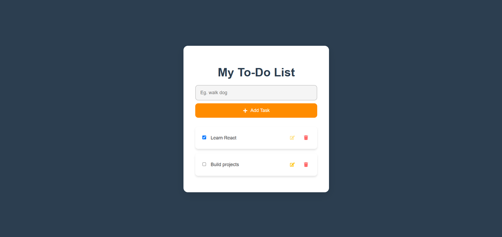

# 📝 To-Do List App

A To-Do List application built with **React** that allows users to manage their tasks efficiently. The app features a clean and eye-catching design, with smooth animations and a user-friendly interface.

  

---

## 🚀 Features

- **Add Tasks**: Easily add new tasks to your to-do list.
- **Mark as Completed**: Check off tasks when they are completed.
- **Edit Tasks**: Update task descriptions with ease.
- **Delete Tasks**: Remove tasks you no longer need.
- **Local Storage**: Tasks are saved in your browser, so they persist even after reloading the page.
- **Responsive Design**: Works seamlessly on desktops, tablets, and mobile devices.

---

## 🛠️ Technologies Used

- **React**: A JavaScript library for building user interfaces.
- **Local Storage**: For persisting tasks in the browser.
- **CSS3**: For styling and animations, including modern design techniques.
- **React Icons**: For adding icons to buttons.

---

## 📦 Installation

To run this project locally, follow these steps:

1. **Clone the repository**:
   ```bash
   git clone https://github.com/sudevo7/my-todo-list.git

2. **Navigate to the project directory**:
   ```bash
   cd my-todo-list

3. **Install dependencies:**:
   ```bash
   npm install

4. **Start the development server**:
   ```bash
   npm start

5.  **Open the app in your browser**:
    Visit http://localhost:3000 to view the app.

## Enjoy using the To-Do List App! 📝